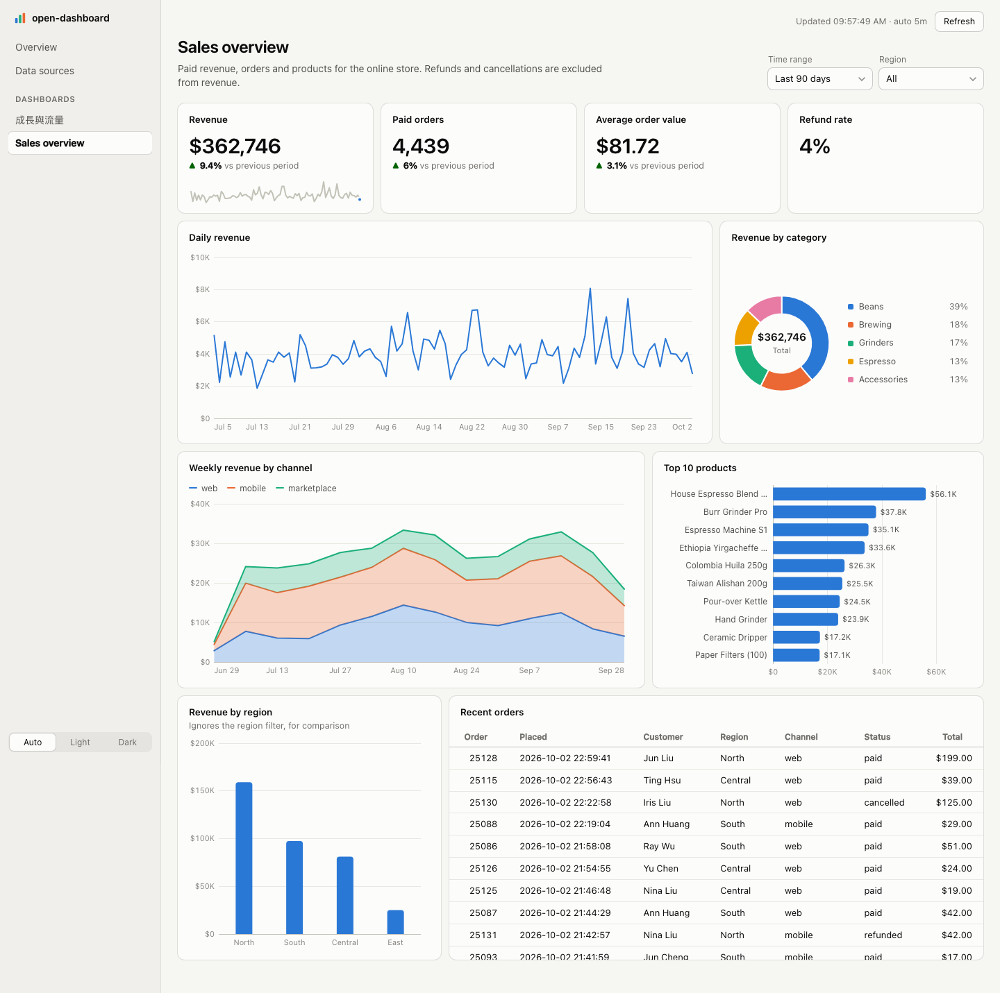

# open-dashboard

**Describe the dashboard you want. Your coding agent builds it — live, over your own database.**

[繁體中文](README.zh-TW.md)



Grafana and Superset ask you to click a dashboard together. open-dashboard is
the other way round: you tell Claude Code (or any coding agent) *"revenue by
month, top 10 products, orders by region, filterable by region"*, and it writes
the SQL and the panels into your workspace. The viewer hot-reloads as it types.

It is the same idea as open-slide, open-doc and open-sheet:
the artifact is plain files an agent is good at writing, the framework does the
rendering, and the skills that ship with every workspace teach the agent the
workflow.

## Quick start

```bash
npx @open-dashboard/cli init my-dashboards
cd my-dashboards
pnpm install
pnpm dev                     # http://localhost:5473
```

The workspace starts empty: the home page asks you to connect a database first,
then to create a dashboard. In your agent:

```
/connect-database  use the Postgres in WAREHOUSE_URL
/create-dashboard  weekly signups by plan, MRR trend, and the 20 accounts with the most usage
```

To try it without a database of your own, `init my-dashboards --sample` adds a
small SQLite shop and a dashboard over it.

## What a dashboard is

```
dashboards/sales-overview/
  queries.sql     named SQL — runnable in any SQL tool
  index.tsx       which panels, in what order, showing which columns
```

```sql
-- name: revenue_by_month
SELECT strftime('%Y-%m', ordered_at) AS month, SUM(total) AS revenue
FROM orders
WHERE status = 'paid' AND ordered_at >= :from AND ordered_at < :to
  AND (:region IS NULL OR region = :region)
GROUP BY month ORDER BY month;
```

```tsx
export const meta: DashboardMeta = { title: 'Sales overview', refresh: '5m' }

export default function SalesOverview() {
  return (
    <Dashboard>
      <Filters>
        <TimeRange default="90d" />
        <Select name="region" query="regions" />
      </Filters>
      <Row>
        <Stat title="Revenue" query="kpis" column="revenue" compare="revenue_prev" format="currency" />
        <Stat title="Orders" query="kpis" column="orders" compare="orders_prev" format="integer" />
      </Row>
      <Row height={320}>
        <LineChart title="Revenue by month" query="revenue_by_month" x="month" y="revenue" format="currency" span={8} />
        <PieChart title="By category" query="revenue_by_category" label="category" value="revenue" span={4} />
      </Row>
    </Dashboard>
  )
}
```

**Panels:** `Stat` (with previous-period delta and sparkline) · `LineChart` ·
`AreaChart` · `BarChart` (grouped, stacked, horizontal) · `PieChart` (donut) ·
`Table` (sortable, inline bars) · `Text`. **Filters:** `TimeRange`, `Select` —
bound to `:from` / `:to` / `:name` and kept in the URL, so a filtered view is a
shareable link. Light and dark themes, a 12-column grid, auto-refresh.

## The loop

1. **Agent explores** — `open-dashboard schema` prints every table, column, key
   and row count; `open-dashboard query "SELECT …"` shows real rows and types.
2. **Agent writes** `queries.sql` + `index.tsx`; the viewer updates live.
3. **Agent verifies** — `open-dashboard check` runs every query with the default
   filters and fails on SQL errors, unknown queries, unbound parameters, and any
   column a panel names that the result does not have.
4. **You review** — hover a panel → inspector shows its SQL, params, rows and
   timing. Type a note ("split this by channel") and it is written into the
   source beside the panel. Ask the agent to `/apply-comments`.

## Datasources

| `type` | Database | Install | Also covers |
| --- | --- | --- | --- |
| `sqlite` | SQLite | built into Node 22.13+ | |
| `postgres` | PostgreSQL | `pnpm add pg` | Supabase, Neon, RDS/Aurora, Cloud SQL, AlloyDB, Redshift, CockroachDB, TimescaleDB |
| `mysql` | MySQL | `pnpm add mysql2` | MariaDB, PlanetScale, TiDB, RDS/Aurora |
| `mssql` | SQL Server | `pnpm add mssql` | Azure SQL Database / Managed Instance |
| `oracle` | Oracle | `pnpm add oracledb` | Autonomous Database (thin mode, no Instant Client) |
| `duckdb` | DuckDB | `pnpm add @duckdb/node-api` | Parquet, CSV and JSON files queried in place |
| `clickhouse` | ClickHouse | `pnpm add @clickhouse/client` | ClickHouse Cloud |
| `bigquery` | BigQuery | `pnpm add @google-cloud/bigquery` | |
| `snowflake` | Snowflake | `pnpm add snowflake-sdk` | |
| `http` | JSON HTTP API | built in | REST and open-data APIs — GET only |
| `mcp` | MCP server | built in | remote or local; read-only tools only |

Configure as many as you like; each query names its `-- source:`. To join
across them, a query can `-- uses:` other queries' results as tables — it runs
in a scratch SQLite over those results, so Postgres can meet ClickHouse
without either database seeing the other. Results are cached for 30 s by
default (`cache` in the config, `-- cache:` per query); the refresh button
always runs fresh.

`open-dashboard drivers` prints each one with a config example. Secrets live in
`.env`; config and `.env` reload without restarting. Every engine except
BigQuery and Snowflake is exercised by the cross-driver test suite against a
real server (`packages/core/src/datasource/conformance.test.ts`); those two are
tested against stand-ins for their SDKs.

## Safety

- **The browser never sends SQL.** It asks for *query `x` of dashboard `y`*;
  the server runs what is on disk. There is no raw-SQL endpoint.
- **Every query is read-only**, by the strongest means each engine offers:
  read-only files (SQLite, DuckDB), `READ ONLY` transactions (Postgres, Oracle,
  MySQL), `readonly=2` (ClickHouse), a dry run that must report SELECT
  (BigQuery). Where DDL can commit past a transaction or none exists (MySQL,
  Oracle, SQL Server, Snowflake, DuckDB), queries must also be a single SELECT.
  Use a read-only database role anyway — `/connect-database` gives the grant.
- **BigQuery spend is capped**: queries over `maximumBytesBilled` (10 GiB by
  default) are refused before they run.
- **Secrets are masked** in every error, log line and CLI message, and the
  dev server never serves a database file, key, `.sql` or `.env` raw. See
  [SECURITY.md](SECURITY.md).
- **Parameters are bound, never interpolated.**
- Results are capped (5,000 rows by default) — aggregate in SQL.

## CLI

```
open-dashboard dev [--port 5473] [--host] [--open]
open-dashboard sources                       test every datasource
open-dashboard schema [source] [--json]      tables, columns, keys, row counts
open-dashboard query "<sql>" [--source s] [--param k=v]
open-dashboard query --dashboard <id> --name <query> [--param k=v]
open-dashboard check [id] [--json]
open-dashboard sync-skills                   update this workspace's agent skills after an upgrade
```

## Skills shipped to every workspace

| Skill | For |
| --- | --- |
| `/connect-database` | add a datasource, `.env`, driver; verify with `sources` + `schema` |
| `/document-database` | write `databases/<source>/database.md`: what tables and columns mean |
| `/create-dashboard` | explore → pin down metric definitions → queries → panels → `check` |
| `/dashboard-authoring` | the reference: query files, parameters, every component, formats, SQL per dialect |
| `/current-dashboard` | resolve "this chart" from what the viewer is showing |
| `/apply-comments` | apply notes left in the inspector |

## Developing

```bash
mise install && pnpm install
pnpm dev        # demo over a seeded SQLite shop, port 5473
pnpm test && pnpm typecheck && pnpm check
```

See [CLAUDE.md](CLAUDE.md) for the architecture and the invariants.

## License

MIT
