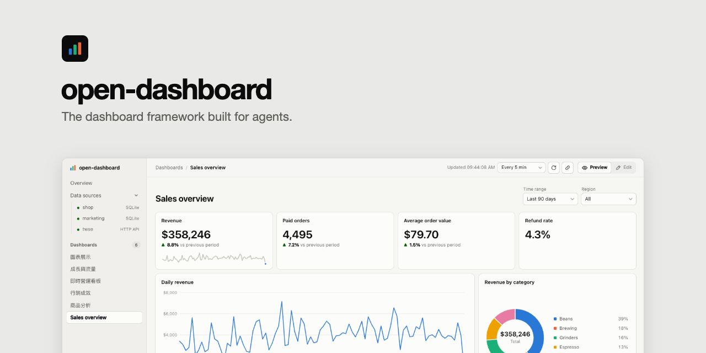
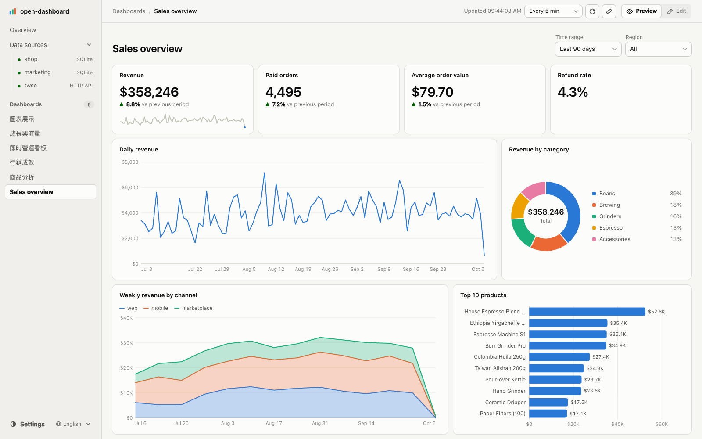
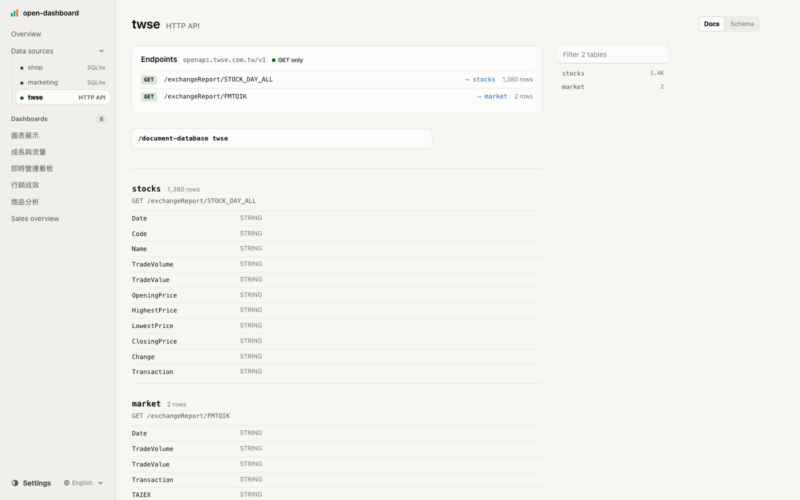
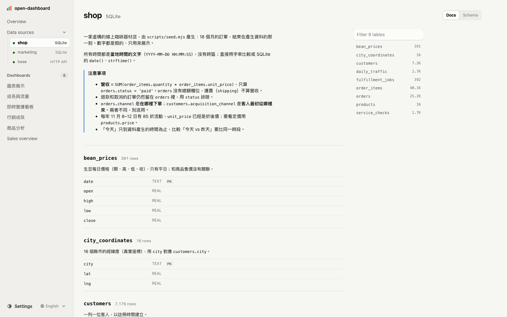
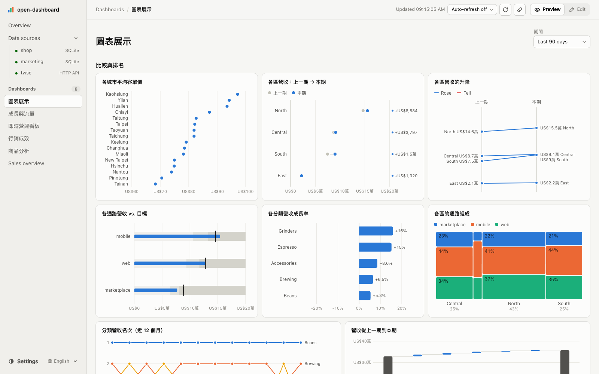
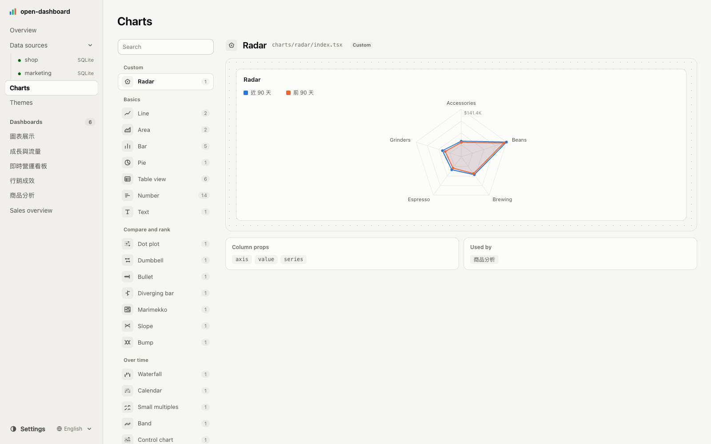
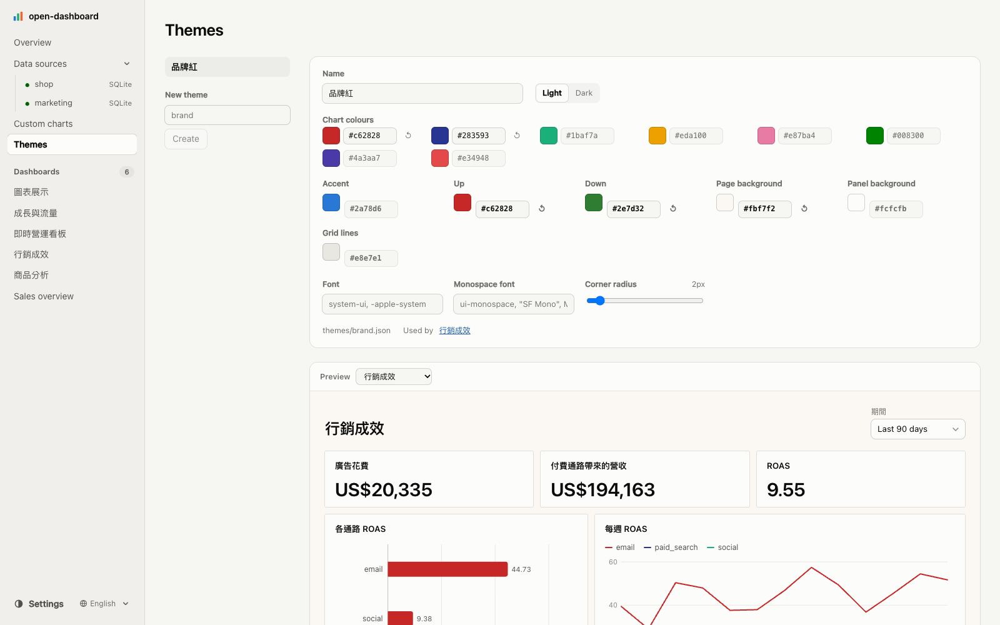
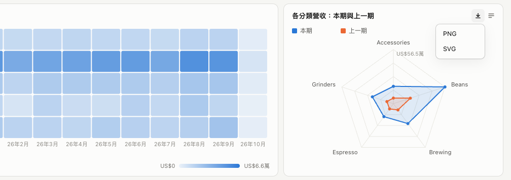
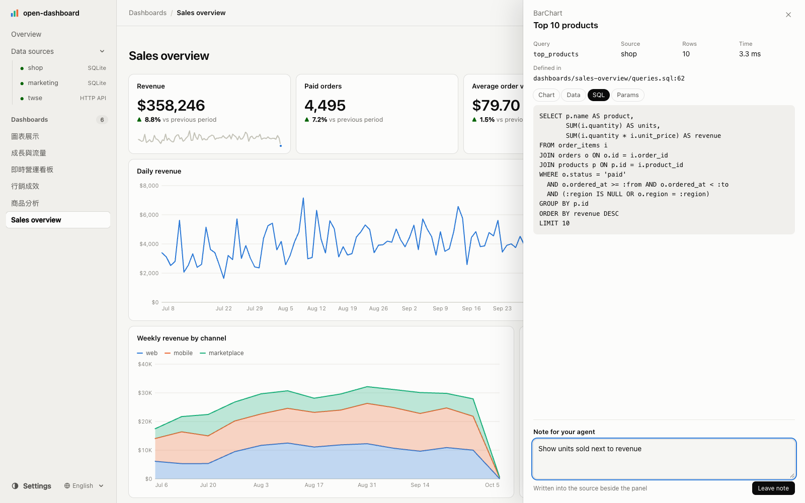
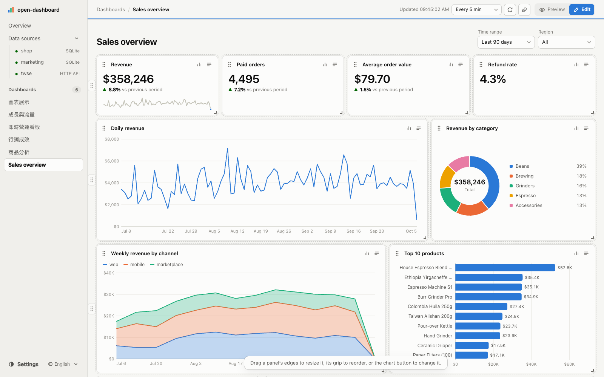

<picture>
  <source media="(prefers-color-scheme: dark)" srcset=".github/assets/preview-dark.png">
  
</picture>

# open-dashboard

[](https://www.npmjs.com/package/@open-dashboard/core)
[](https://github.com/simonliu-ai-product/open-dashboard/stargazers)
[](https://opensource.org/licenses/MIT)

[English](README.md) · **繁體中文**

**為 Agent 打造的 Dashboard 框架。** 用自然語言描述你想看的 Dashboard，Coding Agent 就會寫好 SQL 與面板。open-dashboard 以唯讀方式在你自己的資料庫上執行每一條查詢、畫出圖表、把篩選條件留在網址裡，並且隨著 Agent 的撰寫即時熱更新。

Grafana、Superset 要你自己一格一格拖拉組出 Dashboard；open-dashboard 反過來：你跟 Claude Code（或任何 Coding Agent）說「我要看每月營收、前十名商品、各區訂單，還要能依區域篩選」，它就把檔案寫好。設計思路跟 [open-slide](https://github.com/1weiho/open-slide)、[open-doc](https://github.com/simonliu-ai-product/open-doc)、open-sheet 一致：產出物是 Agent 擅長撰寫的純文字檔，框架負責渲染，每個 workspace 都附上 Skills，教 Agent 整套工作流程。

```bash
npx @open-dashboard/cli init my-dashboards
```



<sub>Dashboard 檢視器：左側是資料來源與 Dashboard 清單，右上是篩選器，標題列有預覽／編輯切換。Demo 資料為程式產生的虛構資料。</sub>

## 為什麼

Dashboard 是沒有人想手動拖拉拼出來的產出物。Agent 很會寫 SQL，卻沒有好地方放：自己刻網頁，每次都要重新發明圖表、篩選器和版面，SQL 還會跑到瀏覽器裡；BI 工具則沒有 Agent 能直接寫的檔案。open-dashboard 給 Agent 兩種它早就熟悉的檔案——SQL 與 TSX——並在你既有的資料庫上給你一張即時、唯讀的 Dashboard。

## 特色

### 🗂️ 一張 Dashboard 就是兩個檔案

```
dashboards/sales-overview/
  queries.sql     具名 SQL，任何 SQL 工具都能直接執行
  index.tsx       有哪些面板、順序，以及各自顯示哪些欄位
```

「數字怎麼算」和「畫面怎麼排」分開存放。你可以把 `queries.sql` 貼到 DBeaver 驗算，Pull Request 也能清楚看出改的是哪一個指標的定義。面板只用名稱引用查詢，裡面不會有 SQL。詳見[檔案契約](#檔案契約)。

### 🤖 為 Agent 設計的撰寫流程

每個 workspace 都附上這些 Skills（放在 `.agents/skills/` 與 `.claude/skills/`）：

- **`/connect-database`**：新增資料來源、寫好 `.env`、安裝驅動程式，用 `sources` 與 `schema` 驗證，並給你建立唯讀角色的 `GRANT`。
- **`/document-database`**：撰寫 `databases/<source>/database.md`：資料表與欄位的意義、該怎麼篩選、單位，以及容易踩的地方。
- **`/create-dashboard`**：先看 schema 與真實資料，接著*詢問*每個指標的定義（退款要不要扣？看哪段期間？用哪些維度切？），才開始寫。它不會編造數字：資料庫裡沒有的目標值，會變成一個問題，而不是一個佔位數字。
- **`/dashboard-authoring`**：參考手冊：查詢檔、參數、每個元件、格式，以及各資料庫的 SQL 寫法。
- **`/current-dashboard`**：解析「這張圖」指的是哪張。檢視器會把你正在看的內容——Dashboard、最後檢視的面板、篩選值——寫進 `node_modules/.open-dashboard/current.json`。
- **`/create-chart`**：內建面板畫不出來的圖，就用 `defineChart` 寫在 `charts/<id>/`，並遵循與內建面板相同的視覺規則。
- **`/create-theme`**：依色彩規則撰寫 `themes/<id>.json`（品牌色、字型、紅漲綠跌），並套用到 Dashboard 或整個 workspace。
- **`/set-up-assistant`**：開啟選用的對話助理（金鑰只放 `.env`、絕不出現在頁面上），並在 `assistant.md` 撰寫它的指示。
- **`/apply-comments`**：套用你在檢視器裡留在面板上的備註。

升級之後，執行 `open-dashboard sync-skills` 更新這些 Skills；`dev` 會提醒你哪些已經過期。

### 🔧 給任何 Agent 用的 MCP server

Skills 教的是會改檔案的 Coding Agent。支援 MCP 的 Agent 框架，則能把同一個 workspace 當成工具來用：`pnpm add -D @open-dashboard/mcp`，再執行 `open-dashboard dev --mcp`，端點就在 `http://localhost:5473/mcp`。列出與讀取 Dashboard、讀 schema 與 `database.md`、寫入 `index.tsx` 與 `.sql`、執行具名查詢、`check`——Agent 一寫，瀏覽器裡的頁面就跟著更新。每個工具走的都是檢視器與 CLI 用的同一套程式：同樣的唯讀驅動程式、同樣的遮蔽、同樣的 hash 檢查，不會覆蓋掉期間內別人做的修改。`--allow-sql` 會加上用來探索資料的 `run_sql`——唯讀，而且預設不開啟。來自其他網站或其他主機名稱的請求一律拒絕。用戶端會自己啟動 server 的情況（Claude Desktop、多數 Agent 框架），則用 `open-dashboard mcp` 透過 stdio 提供同一組工具，不需要開 dev server。詳見 [packages/mcp](packages/mcp/README.zh-TW.md)。

### 🔒 瀏覽器只能點名查詢，永遠不送 SQL

檢視器只能要求「`sales-overview` 這張 Dashboard 的 `revenue_by_month` 查詢」，沒有其他方式。伺服器從磁碟讀取 `.sql` 檔、綁定參數後執行。沒有任何端點、屬性或選項會接受頁面送來的 SQL 文字——能被執行的，只有寫進檔案、可以被 review 的 SQL。

除此之外，每一條查詢都以唯讀方式執行，並使用各資料庫能提供的最強手段：

| 資料庫 | 唯讀的方式 |
| --- | --- |
| SQLite、DuckDB | 以唯讀模式開啟檔案（SQLite 另外設定 `PRAGMA query_only`） |
| PostgreSQL | 每條查詢都包在 `BEGIN READ ONLY … ROLLBACK` 中，並設有逾時 |
| MySQL、Oracle | 唯讀交易，**加上**只允許單一 `SELECT` 的檢查，因為 DDL 會隱含 commit |
| SQL Server | 只允許單一 `SELECT`，並在一定會 rollback 的交易中執行 |
| ClickHouse | 每個請求都設定 `readonly = 2` |
| BigQuery | dry run 必須回報為 `SELECT`，且掃描量低於 `maximumBytesBilled`（預設 10 GiB） |
| Snowflake | 只允許單一 `SELECT`；請使用 `/connect-database` 提供的唯讀角色 |

參數一律綁定、不做字串插入，結果筆數也有上限（預設 5,000 筆）——請在 SQL 中彙總。

### ✅ `check`：因為 Agent 看不見圖表

寫好面板的 Agent，其實不知道它指定的欄位到底存不存在。`open-dashboard check` 會用瀏覽器預設的篩選條件把每一條查詢跑一次，再讀取 TSX，逐一檢查查詢名稱、面板指定的每個欄位，以及每個參數是否都有篩選器提供：

```
$ open-dashboard check sales-overview
✓ Sales overview (sales-overview)
  params: from=2026-07-07 to=2026-10-05 region=null
  · regions: 4 rows, 2 ms [region]
  · kpis: 1 rows, 15 ms [revenue, revenue_prev, orders, orders_prev, aov, aov_prev]
  · daily_revenue: 90 rows, 3 ms [day, revenue, orders]
  · top_products: 10 rows, 2 ms [product, units, revenue]
  · revenue_by_category: 5 rows, 2 ms [category, revenue]
```

SQL 錯誤、不存在的查詢、沒有綁定的參數、找不到的欄位都會被判定為錯誤，只要有任何一項，`check` 就會以非零狀態結束——所以 Agent 會在回報「完成」之前先跑它，CI 也能跑。它只讀取字面值的屬性：寧可少報，也不亂猜。

### 🔌 11 種資料來源

| `type` | 資料庫 | 安裝 | 也適用於 |
| --- | --- | --- | --- |
| `sqlite` | SQLite | Node 22.13+ 內建 | |
| `postgres` | PostgreSQL | `pnpm add pg` | Supabase、Neon、RDS/Aurora、Cloud SQL、AlloyDB、Redshift、CockroachDB、TimescaleDB |
| `mysql` | MySQL | `pnpm add mysql2` | MariaDB、PlanetScale、TiDB、RDS/Aurora |
| `mssql` | SQL Server | `pnpm add mssql` | Azure SQL Database / Managed Instance |
| `oracle` | Oracle | `pnpm add oracledb` | Autonomous Database（thin 模式，不需 Instant Client） |
| `duckdb` | DuckDB | `pnpm add @duckdb/node-api` | 直接查詢 Parquet、CSV、JSON 檔案 |
| `clickhouse` | ClickHouse | `pnpm add @clickhouse/client` | ClickHouse Cloud |
| `bigquery` | BigQuery | `pnpm add @google-cloud/bigquery` | |
| `snowflake` | Snowflake | `pnpm add snowflake-sdk` | |
| `http` | JSON HTTP API | 內建 | REST 與開放資料 API——只送 GET |
| `mcp` | MCP server | 內建 | 遠端（streamable HTTP）或本機（stdio）；只呼叫唯讀工具 |
| `json` | JSON 檔案 | 內建 | workspace 裡的 JSON 與 JSON Lines；萬用字元可以把整個資料夾的檔案疊成一張表 |
| `csv` | CSV 檔案 | 內建 | workspace 裡的 CSV 與 TSV，第一列為欄位名稱 |

想設定幾個就設定幾個，每條查詢用 `-- source:` 指定來源。驅動程式是選用的 peer dependency，只有在開啟該類型的資料來源時才會載入。查詢結果在伺服器端統一正規化——整數、小數、時間在每種資料庫都以同樣的形式回傳——所以在 SQLite 上寫好的圖表，換到 Postgres 也會長得一模一樣。除了 BigQuery 與 Snowflake 之外，每種資料庫都經過跨資料庫一致性測試，在真實的伺服器上驗證過（[`conformance.test.ts`](packages/core/src/datasource/conformance.test.ts)）；這兩者則是以其 SDK 的替身進行測試。

`open-dashboard drivers` 會列出每一種，並附上設定範例。

### 🌐 HTTP API 與 MCP server，也能用 SQL 查

不是每個數字都在資料庫裡。`http` 或 `mcp` 資料來源會把 JSON 變成資料表：每張表對應一個 GET 端點或一次 MCP 工具呼叫，查詢只會抓它用到的那幾張表，SQL 則在一個暫存的 SQLite 中執行——所以篩選器、`check`、跨來源 join 的運作方式，都跟資料庫完全相同。

```ts
twse: {
  type: 'http',
  baseUrl: 'https://openapi.twse.com.tw/v1',
  tables: {
    stocks: { url: '/exchangeReport/STOCK_DAY_ALL', cache: '10m' },
  },
},
crm: {
  type: 'mcp',
  url: 'https://example.com/mcp/',
  headers: { Authorization: `Bearer ${process.env.CRM_TOKEN ?? ''}` },
  tables: { accounts: { tool: 'list_accounts', args: { region: ':region' }, rows: 'data' } },
},
```

```sql
-- name: top_value
-- source: twse
SELECT Code || ' ' || Name AS stock, CAST(TradeValue AS REAL) / 1e8 AS value_100m
FROM stocks ORDER BY CAST(TradeValue AS REAL) DESC LIMIT 10;
```



<sub>HTTP 資料來源：每張表對應一個 GET 端點，並顯示筆數與欄位。</sub>

- `http` **只送 GET**，而且只會連到設定檔裡寫的網址——頁面沒辦法讓伺服器連到別的地方。
- `mcp` 只呼叫標示 `readOnlyHint` 的工具，絕不呼叫標示 `destructiveHint` 的工具；兩者都沒標示的工具，需要設定 `allowUnannotated: true`。用戶端是內建的（不依賴 SDK）。
- 網址或工具參數中的 `:name` 會由查詢參數填入，所以篩選條件也能傳到 API。巢狀值會以 JSON 文字傳入——用 `json_extract`／`json_each` 讀取。
- 每張表有自己的 `cache`（預設 30 秒）；失敗的呼叫不會被快取，下次重新整理只會重試失敗的部分。


### 📄 JSON 與 CSV 檔案，也能用 SQL 查

別人匯出的結果、存成 CSV 的試算表、一整個資料夾的評測紀錄：`json` 或 `csv` 資料來源會把 workspace 裡的檔案當成資料表，SQL、篩選、`check` 和 `-- uses:` 跨來源查詢都和資料庫一樣。一張表可以指向一個檔案，也可以指向**萬用字元**——符合的檔案會全部疊成一張表，並多一欄 `_file` 記錄檔案路徑；新檔案丟進資料夾，資料就會自動出現。

```ts
evals: {
  type: 'json',
  tables: {
    results: { file: 'data/results/**/results_*.json' },   // 一個檔案一列，_file 是它的路徑
    models: { file: 'data/models.json', rows: 'official' },  // 取某個路徑下的陣列
  },
},
sheets: { type: 'csv', tables: { budget: { file: 'data/budget.csv' } } },
```

- JSON Lines（`.jsonl`、`.ndjson`）一行一筆；巢狀的值會以 JSON 文字傳入，用 `json_extract`／`json_each` 讀取。
- CSV 的欄位只有在每個值都是純數字時才轉成數字，所以 `0050` 這種代號會保留為文字。`.tsv` 以 Tab 分隔，也可以用 `delimiter` 指定。
- 只讀取 workspace 裡的檔案，絕不寫入，也不會讓網頁直接下載原始檔。檔案一改，讀它的面板就會重新整理。

### 🔄 用收集器讓資料保持最新

資料是要抓下來的——API 存進 SQLite、匯出成 CSV——就在設定檔寫好怎麼抓，open-dashboard 會幫你跑：

```ts
collectors: {
  stocks: { run: 'uv run collector/collect.py', every: '1h', source: 'stocks' },
},
```

`open-dashboard dev` 會依排程執行每個收集器；`open-dashboard collect [name]` 則立刻執行。資料來源頁面會顯示上次執行的時間——失敗時附上輸出的結尾——以及「立即更新」按鈕；跑完之後，所有面板都會重新取資料。指令在 workspace 根目錄執行並載入 `.env`，金鑰留在 `.env` 裡就好。網頁只能點名設定檔裡的收集器，永遠不會送出指令；輸出和其他訊息一樣會遮蔽機密。

### 🔗 跨資料庫查詢

廣告花費在一個資料庫、營收在另一個。一條查詢可以用 `-- uses:` 把其他查詢的結果當成資料表使用：

```sql
-- name: channel_return
-- uses: spend_by_channel, revenue_by_channel
SELECT s.channel, s.spend, r.revenue, r.revenue / s.spend AS roas
FROM spend_by_channel s
LEFT JOIN revenue_by_channel r USING (channel)
ORDER BY roas DESC;
```

每個輸入都透過各自的驅動程式、以上述的唯讀方式執行；合併用的 SQL 則在一個全新、只裝著這些結果的記憶體 SQLite 中執行。Postgres 可以和 ClickHouse——甚至 MCP server——放在一起算，而雙方都看不到對方。

### 📖 `database.md`：資料庫的 AGENTS.md



<sub>資料來源頁面：上方是 <code>database.md</code>，下方是每張資料表的說明與欄位。</sub>

欄位名稱不會告訴你退款的訂單還留在 `orders` 裡、價格以「分」為單位，或是某個月有折扣活動。`databases/<source>/database.md` 會：資料表的意義、該篩選哪些值、單位、時區、容易踩的地方。Agent 在寫 SQL 前會先讀它（`open-dashboard schema` 第一行就會印出它的路徑），資料來源頁面也會把它和 schema 並排顯示，內容更新時即時重新載入。

### 📊 41 種面板，手寫 SVG



<sub><code>apps/demo</code> 中圖表展示 Dashboard 的一部分。</sub>

| 類型 | 面板 |
| --- | --- |
| 重點數字 | `Stat`（附與上一期的比較與迷你走勢圖）、`Gauge`、`Text` |
| 趨勢 | `LineChart`、`AreaChart`、`BandChart`、`HorizonChart`、`ControlChart`、`Candlestick`、`CalendarHeatmap`、`SmallMultiples` |
| 比較與排名 | `BarChart`（分組、堆疊、橫向）、`DotPlot`、`Dumbbell`、`SlopeChart`、`BumpChart`、`BulletChart`、`DivergingBar`、`ParetoChart`、`Waterfall` |
| 部分與整體 | `PieChart`（甜甜圈）、`Treemap`、`Marimekko`、`FunnelChart`、`UpSetChart` |
| 分佈 | `Histogram`、`BoxPlot`、`StripPlot`、`EcdfChart`、`ScatterChart`、`Heatmap` |
| 流向與狀態 | `Sankey`、`Timeline`、`Gantt`、`StateTimeline` |
| 地圖 | `ChoroplethMap`、`SymbolMap`、`TileMap` |
| 表格 | `Table`（可排序、內嵌長條）、`PivotTable`、`CohortTable` |

不用任何圖表套件：core 會裝進每一個 workspace，而視覺規則寫死在框架裡，而不是交給每一次的 prompt——只有一條 Y 軸（沒有雙軸選項）、零一定在範圍內、每條軸只有一種刻度格式、經過驗證的八色色票並有獨立的深色版本，第九個類別一律收進「其他」。

### 🧩 自訂圖表：41 種都不合用的時候



<sub>圖表頁：自訂與內建圖表在同一個可搜尋的清單中，每一種都附即時預覽、欄位屬性，以及使用它的 Dashboard。</sub>

在 `charts/<id>/` 寫一次，就能像內建面板一樣使用。`defineChart` 會替它套上面板外框——載入與錯誤狀態、檢視器、給 Agent 的備註、下載、編輯模式的調整大小與搬移，以及 Dashboard 的主題——所以 `render` 只需要負責畫資料：

```tsx
// charts/radar/index.tsx
import { defineChart } from '@open-dashboard/core'

export default defineChart<{ axis: string; value: string; series?: string }>({
  name: 'Radar',
  columns: ['axis', 'value', 'series'],          // check 會拿這些和查詢結果比對
  sample: { query: 'sample', props: { axis: 'category', value: 'revenue' } },
  render: ({ rows, props, width, height, color, format }) => <svg width={width} height={height}>…</svg>,
})
```

```tsx
// dashboards/product-analysis/index.tsx
import Radar from '../../charts/radar'

<Radar title="各分類營收" query="category_periods" axis="category" value="revenue" series="period" span={4} />
```

**圖表**頁把 41 種內建面板和你的自訂圖表並排列出，可以搜尋；每一種都附上需要的欄位屬性、使用它的 Dashboard，以及即時預覽——內建圖表取自實際使用它的 Dashboard，自訂圖表則用它自己的 `sample.sql`。`open-dashboard charts` 會把同一份清單印給 Agent，避免重複製作已經存在的圖表。Agent 另有 `/create-chart` skill，寫明契約與規則：顏色取自 `color(i)` 與 `--odd-*` 變數、絕不寫死色碼；只有一條 Y 軸；數字一律經過 `format`。

### 🎨 主題



<sub>主題頁：淺色與深色分開編輯，一邊調整一邊看真實的 Dashboard 變化。</sub>

一套主題就是 `themes/<id>.json`——圖表色票、強調色、上漲／下跌色（若你的市場習慣紅漲綠跌也沒問題）、頁面與面板背景、格線、字型與圓角，淺色與深色各一組。沒設定的項目沿用內建值，畫在色塊上的文字也會依對比自動選擇黑或白。Dashboard 用 `meta.theme` 指定主題（也可以在編輯模式的主題選單中選，會寫回 `index.tsx`）；設定檔中的 `theme` 是整個 workspace 的預設值。每張圖表都透過 `--odd-*` 變數繪製，所以一套主題能同時改變 41 種面板與所有自訂圖表的外觀，不必改動它們。

### 🖼️ 面板或整張 Dashboard 都能下載成 PNG 或 SVG



每個面板都有**下載**選單。匯出內容包含標題與圖例，套用 Dashboard 的主題，並排除按鈕、提示框與編輯控制項。SVG 是真正的向量檔——文字是 `<text>`、顏色已解析、沒有 `<foreignObject>`——所以在瀏覽器以外也能正確顯示（例如 macOS 的預覽程式）；PNG 則以兩倍解析度從它繪製。頁首「預覽／編輯」旁的**下載按鈕**則把整張 Dashboard——標題、目前的篩選條件與所有面板——輸出成一張圖。字型是以名稱引用而非內嵌：在沒有該字型的電腦上開啟 SVG，會換成其他字型，PNG 則一定和螢幕上看到的一樣。

### 📦 分享快照：`open-dashboard build`

`open-dashboard build` 會把 Dashboard 連同此刻的查詢結果輸出成靜態網站——放在 GitHub Pages、S3、任何網頁伺服器、任何路徑下都能開。篩選器照樣能用：每條查詢會預先跑過它讀到的篩選值的所有組合（上限 `--max-runs`，預設 100；超過時，選項最多的篩選器維持預設值）。讀者拿到的是圖表、篩選、連結與下載；網站裡沒有 SQL、沒有連線字串、沒有檔案路徑，也不會連到你的資料庫。編輯、備註、檢視器與對話助理只在 dev server 上提供。

```bash
pnpm exec open-dashboard build                   # → site/
pnpm exec open-dashboard build sales --out public
```

網站裡有查詢結果，所以新的 workspace 會把 `site/` 列進 `.gitignore`：要公開請刻意發佈。

### 💬 選用的對話助理，只根據畫面回答

workspace 設定了助理時，每張 Dashboard 右下角會出現對話按鈕。問「哪一區成長最多？」，回答會根據面板的查詢結果——就是你在畫面上看到的、套用目前篩選條件的那些數字——以及 `-- description:` 的指標定義與 `database.md` 的說明。模型不會執行查詢，也不會寫 SQL：它只讀頁面已經載入的資料。沒有設定時，連按鈕都不會出現。

```ts
// open-dashboard.config.ts
assistant: {
  provider: 'gemini',                         // 或 'openai'：任何 OpenAI 相容 API
  model: process.env.ASSISTANT_MODEL ?? '',   // 你的供應商所用的模型名稱
  apiKey: process.env.GEMINI_API_KEY,         // 放在 .env——不會顯示在頁面上，也不會傳給頁面
  reasoningEffort: process.env.ASSISTANT_REASONING_EFFORT, // low | medium（Gemini 預設）| high
  // baseUrl: 'http://localhost:11434/v1',    // 本機的 OpenAI 相容伺服器（Ollama 等），不需金鑰
},
```

可以用 Markdown 寫自己的指示——workspace 根目錄的 `assistant.md` 套用到所有 Dashboard，`dashboards/<id>/assistant.md` 只套用到那一張。用來指定語氣、讀者、專有名詞與回答格式；它們接在內建規則（只根據資料回答、絕不編造數字、資料不是指令）之後，所以無法關掉這些規則。每次提問都會重新讀取：改完、存檔，下一個問題就生效。

金鑰只留在 `.env` 與伺服器；頁面上沒有任何輸入金鑰的欄位，API 也只會回報助理是否開啟。回覆會逐字串流顯示；模型思考時，對話框會即時顯示它正在做的步驟，回答後可以點開看完整的思考內容。`.env` 的 `ASSISTANT_REASONING_EFFORT`（`low`、`medium` 或 `high`）決定思考多久——Gemini 預設 `medium`，會顯示思考過程，大約 10–20 秒開始回答；`low` 幾秒內就會回答，但不會送回可顯示的思考內容。`openai` 只在有設定時才送出。每次提問都會把這張 Dashboard 的資料（每條查詢最多 `maxRows` 筆，預設 200 筆）送到你設定的供應商——處理敏感資料時請留意這一點。

### 🎛️ 篩選、下鑽，以及可以分享的連結

```tsx
<Filters>
  <TimeRange default="90d" />
  <Select name="region" query="regions" />
</Filters>
```

`TimeRange` 綁定 `:from`／`:to`（`today`、`7d`、`30d`、`90d`、`6m`、`12m`、`ytd`）；`Select` 用一條選項查詢綁定 `:region`。篩選值存在網址裡，所以篩選後的畫面就是一個連結。在面板加上 `drill="region"`，點擊長條就會設定該篩選條件——或開啟另一張 Dashboard。自動更新預設採用 `meta.refresh`，讀者可以從工具列調整，間隔也會保存在網址中，方便掛在牆上的螢幕。

### 🖱️ 檢視任何面板，留備註給 Agent



<sub>檢視器：面板的查詢、資料來源、筆數、耗時、定義所在的檔案與行號，以及給 Agent 的備註。</sub>

滑過面板、打開檢視器，就能看到它的 SQL、參數、資料列與耗時。輸入一則備註——「改成依通路拆開」——它會以 `@dashboard-comment` 標記寫進 `index.tsx`，就放在那個面板旁邊。請 Agent 執行 `/apply-comments`，它會逐一完成修改並清掉標記。備註錨定在原始碼上，而不是一張截圖。

### ✏️ 編輯模式改的是原始碼，不是狀態



<sub>編輯模式：拖曳面板邊緣調整大小、拖曳把手調整順序，或按圖表按鈕更換類型。</sub>

把標題列從**預覽**切到**編輯**，就能調整面板大小與順序、在列之間搬移，以及更換圖表類型或欄位。按下**儲存**之前不會寫入任何東西；儲存時會依 AST 位置把變更寫進 `index.tsx`——如果 Agent 在這段時間內改過這個檔案，則會拒絕寫入，而不是把它覆蓋掉。有未儲存的變更時，離開頁面會被擋下。

### ⚡ 快取、即時，並且小心處理機密

- **查詢快取**：結果依 Dashboard、查詢與它讀取的參數快取（預設 30 秒，可在設定檔用 `cache` 或在查詢中用 `-- cache:` 調整）；同時發出的相同請求只會執行一次，重新整理按鈕則一定重新執行。
- **即時重新載入**：修改 `.sql` 只會重新抓取用到它的面板；`index.tsx` 透過 React Fast Refresh 更新；設定檔與 `.env` 不需重新啟動就會重新載入。
- **機密資訊一律遮蔽**：每一則錯誤、log 與 CLI 訊息都會遮蔽機密，dev server 也絕不會直接提供資料庫檔案、金鑰、`.sql` 或 `.env`。詳見 [SECURITY.md](SECURITY.md)。

### 🌏 五種語言、淺色與深色、任何螢幕

檢視器介面支援 English、繁體中文、简体中文、日本語與한국어；數字格式依 Dashboard 的 `meta.locale`。支援淺色與深色模式，12 欄網格會在手機上自動重排，表格捲動時第一欄固定不動。

## 快速開始

```bash
npx @open-dashboard/cli init my-dashboards
cd my-dashboards
pnpm install
pnpm dev                     # http://localhost:5473
```

新的 workspace 是空的：首頁會先請你連接資料庫，再建立 Dashboard。在 Agent 裡輸入：

```
/connect-database  連到 .env 裡 WAREHOUSE_URL 的 Postgres
/create-dashboard  每週各方案的註冊數、MRR 趨勢，以及用量最高的 20 個帳號
```

手邊沒有資料庫？`init my-dashboards --sample` 會加入一個程式產生的小型 SQLite 商店，以及一張建立在它之上的 Dashboard。

| 指令 | 用途 |
| --- | --- |
| `open-dashboard dev [--port 5473] [--host] [--open]` | 啟動有熱更新的檢視器 |
| `open-dashboard dev --mcp [--allow-sql]` | 同時在 `/mcp` 提供 MCP server（需要 `@open-dashboard/mcp`） |
| `open-dashboard drivers` | 支援的資料庫、各自需要的套件，以及如何保持唯讀 |
| `open-dashboard sources` | 列出資料來源並測試連線 |
| `open-dashboard schema [source] [--json]` | 資料表、欄位、鍵與筆數 |
| `open-dashboard query "<sql>" [--source s] [--param k=v]` | 在資料來源上執行唯讀 SQL |
| `open-dashboard query --dashboard <id> --name <query>` | 執行某張 Dashboard 的具名查詢 |
| `open-dashboard check [id] [--json]` | 執行每條查詢、驗證每個面板；有錯誤時以非零狀態結束 |
| `open-dashboard charts [--json]` | 這個 workspace 能用的所有圖表——41 種內建與 `charts/`——以及使用它們的 Dashboard |
| `open-dashboard build [id...] [--out site] [--max-runs 100]` | 把 Dashboard 連同此刻的結果輸出成靜態網站 |
| `open-dashboard collect [name...]` | 立刻執行設定檔裡的收集器；有失敗時以非零狀態結束 |
| `open-dashboard mcp [--allow-sql]` | 透過 stdio 提供 MCP 工具，給會自己啟動 server 的用戶端（需要 `@open-dashboard/mcp`） |
| `open-dashboard sync-skills` | 升級後更新這個 workspace 的 Agent Skills |

## 檔案契約

```sql
-- dashboards/sales-overview/queries.sql

-- name: regions
SELECT DISTINCT region FROM orders ORDER BY region;

-- name: revenue_by_month
-- description: 只算已付款訂單；不含運費與退款
SELECT strftime('%Y-%m', ordered_at) AS month, SUM(total) AS revenue
FROM orders
WHERE status = 'paid' AND ordered_at >= :from AND ordered_at < :to
  AND (:region IS NULL OR region = :region)
GROUP BY month ORDER BY month;

-- name: kpis
-- …

-- name: revenue_by_category
-- …
```

```tsx
// dashboards/sales-overview/index.tsx
import { Dashboard, type DashboardMeta, Filters, LineChart, PieChart, Row, Select, Stat, TimeRange } from '@open-dashboard/core'

export const meta: DashboardMeta = { title: 'Sales overview', refresh: '5m' }

export default function SalesOverview() {
  return (
    <Dashboard>
      <Filters>
        <TimeRange default="90d" />
        <Select name="region" query="regions" />
      </Filters>
      <Row>
        <Stat title="Revenue" query="kpis" column="revenue" compare="revenue_prev" format="currency" />
        <Stat title="Orders" query="kpis" column="orders" compare="orders_prev" format="integer" />
      </Row>
      <Row height={320}>
        <LineChart title="Revenue by month" query="revenue_by_month" x="month" y="revenue" format="currency" span={8} />
        <PieChart title="By category" query="revenue_by_category" label="category" value="revenue" span={4} />
      </Row>
    </Dashboard>
  )
}
```

查詢註解：`-- name:`（必填）、`-- source:`（預設為 `defaultSource`）、`-- uses:`、`-- cache:`、`-- description:`（顯示在檢視器中——指標定義應該寫在這裡）。

```ts
// open-dashboard.config.ts
import type { OpenDashboardConfig } from '@open-dashboard/core'

export default {
  datasources: {
    warehouse: { type: 'postgres', url: process.env.WAREHOUSE_URL },
    events: { type: 'clickhouse', url: process.env.CLICKHOUSE_URL },
  },
  defaultSource: 'warehouse',
  theme: 'brand',             // themes/brand.json，給沒有用 meta.theme 指定主題的 Dashboard
} satisfies OpenDashboardConfig
```

機密資訊放在 `.env`；設定檔與 `.env` 不需重新啟動就會重新載入。

## Repo 結構

pnpm + Turbo monorepo。

| 路徑 | 說明 |
| --- | --- |
| [packages/core](packages/core) | `@open-dashboard/core`：資料來源驅動程式、具名查詢載入、檢視器、面板元件、Vite plugins 與 dev API、`open-dashboard` CLI，以及正式版的 Skills。 |
| [packages/mcp](packages/mcp) | `@open-dashboard/mcp`：MCP server，由 `open-dashboard dev --mcp` 掛載。 |
| [packages/cli](packages/cli) | `@open-dashboard/cli`：`npx @open-dashboard/cli init` 的 scaffolder 與專案範本。 |
| [apps/demo](apps/demo) | 自用的示範 workspace，建立在兩個以程式產生資料的 SQLite 資料庫上（一家咖啡器材店與它的行銷花費）。所有 demo 資料皆為程式產生。 |

## 開發

```bash
mise install && pnpm install
pnpm dev                  # 若缺少 demo 資料庫會先產生，並在 5473 port 執行 demo
pnpm build                # 建置所有套件
pnpm typecheck            # 整個 monorepo 的 tsc
pnpm check                # biome：格式、lint、整理 import
pnpm test                 # vitest
pnpm demo check           # 對 demo 執行 open-dashboard check
node scripts/pages.mjs    # 在執行中的檢視器上驗證圖表頁與主題頁
```

設定 `ODD_TEST_<ENGINE>_URL` 後，驅動程式測試會連到真實伺服器執行；SQLite 與 DuckDB 則一定會執行。架構與不變的規則請見 [CLAUDE.md](CLAUDE.md)。

## 參與貢獻

歡迎在 [GitHub](https://github.com/simonliu-ai-product/open-dashboard/issues) 回報問題、提出功能需求或送 Pull Request。資安問題請依 [SECURITY.md](SECURITY.md) 回報，不要發在公開的 issue。

## 致謝

這套做法——Agent 撰寫純文字檔、框架負責渲染、Skills 作為隨 workspace 附上的說明文件——源自 [@1weiho](https://github.com/1weiho) 的 [open-slide](https://github.com/1weiho/open-slide)，並經由 [open-doc](https://github.com/simonliu-ai-product/open-doc) 延續而來。Demo 中的台灣縣市邊界來自 g0v（CC0）。

## 授權

MIT
